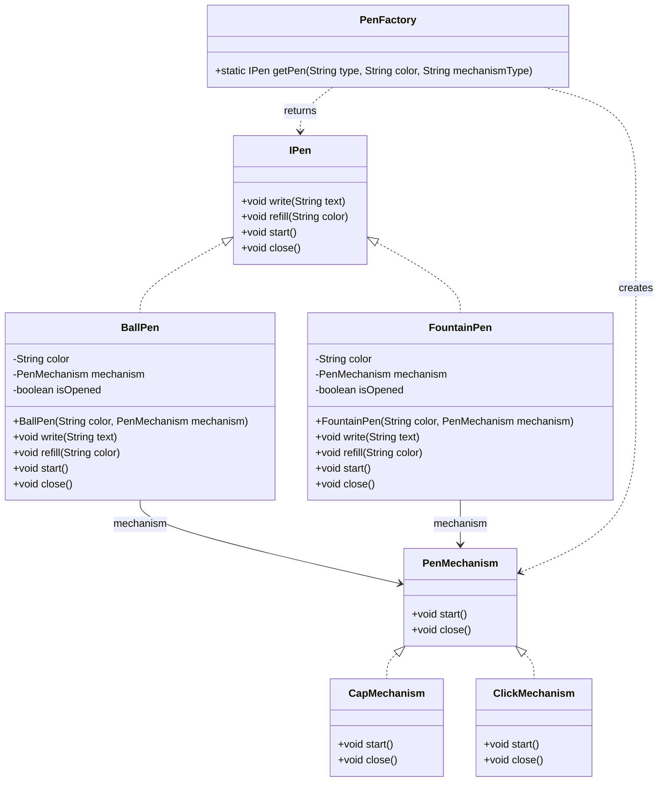

# Pen System UML Class Diagram

```mermaid
classDiagram
    IPen <|.. BallPen
    IPen <|.. FountainPen
    PenMechanism <|.. CapMechanism
    PenMechanism <|.. ClickMechanism

    class IPen {
        +void write(String text)
        +void refill(String color)
        +void start()
        +void close()
    }

    class PenMechanism {
        +void start()
        +void close()
    }

    class BallPen {
        -String color
        -PenMechanism mechanism
        -boolean isOpened
        +BallPen(String color, PenMechanism mechanism)
        +void write(String text)
        +void refill(String color)
        +void start()
        +void close()
    }

    class FountainPen {
        -String color
        -PenMechanism mechanism
        -boolean isOpened
        +FountainPen(String color, PenMechanism mechanism)
        +void write(String text)
        +void refill(String color)
        +void start()
        +void close()
    }

    class CapMechanism {
        +void start()
        +void close()
    }

    class ClickMechanism {
        +void start()
        +void close()
    }

    BallPen --> PenMechanism : mechanism
    FountainPen --> PenMechanism : mechanism
    PenFactory ..> IPen : returns
    PenFactory ..> PenMechanism : creates

    class PenFactory {
        +static IPen getPen(String type, String color, String mechanismType)
    }
```
